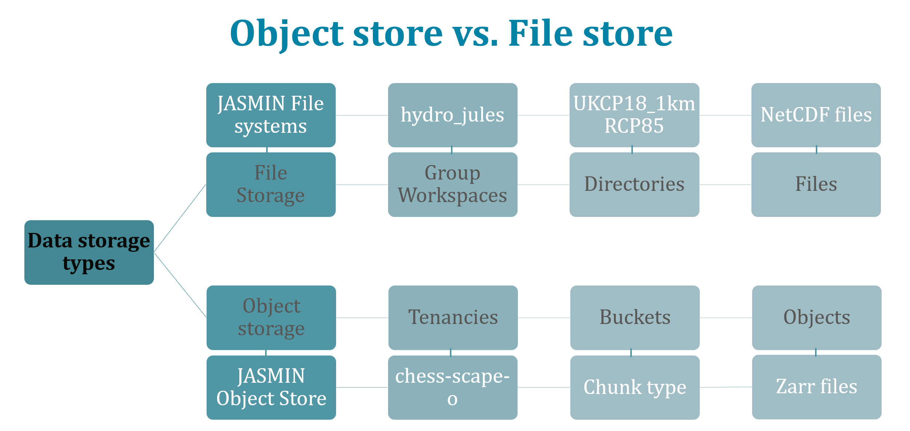
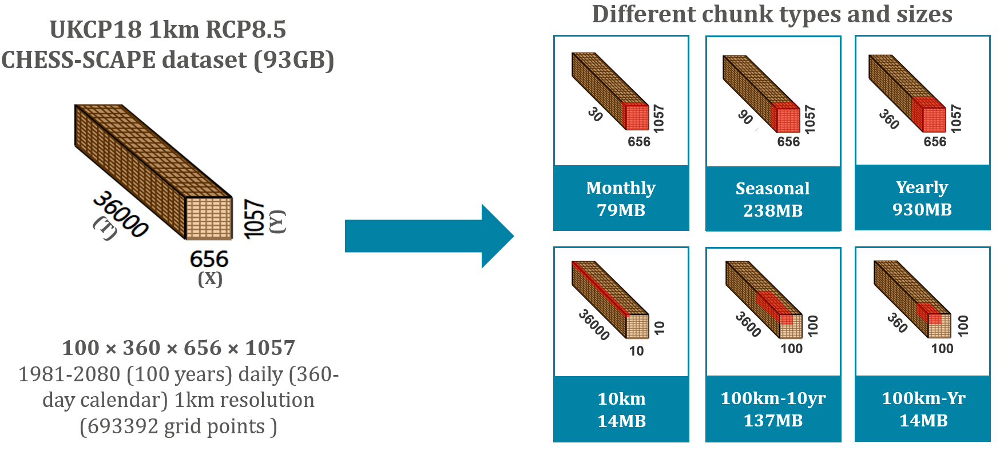
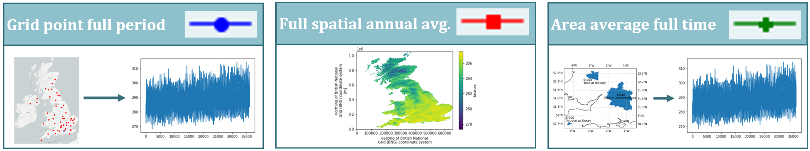
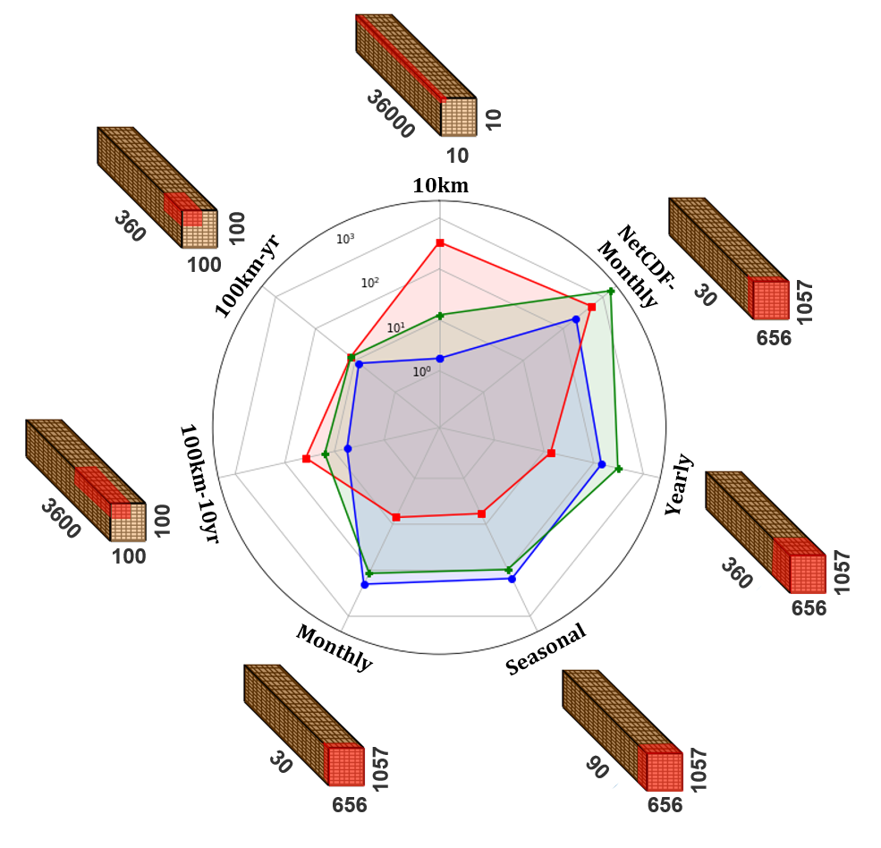
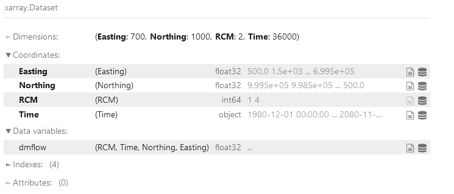
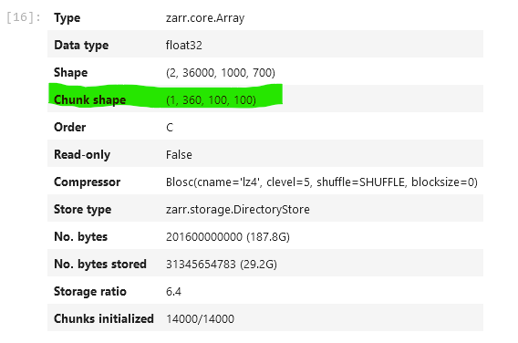

# README for the GitHub repository
This GitHub repository offers sample notebooks and guides for utilizing Object Storage. This README introduces Object Storage and provides instructions for using the resources within this respository for accessing Object Storage, uploading data to it, and using that data from external platforms.

**Authors:** *Matt Brown* and *Amulya Chevuturi*, UK Centre for Ecology & Hydrology, Wallingford, UK (matbro@ceh.ac.uk; amuche@ceh.ac.uk)

**Contact:** For more information please contact Matt Fry (mfry@ceh.ac.uk)

**Acknowledgements**: This work was undertaken at UK Centre for Ecology & Hydrology (UKCEH) and supported by Natural Environment Research Council's Hydro-JULES research programme (HJ; NE/S017380/1), UK Status, Change and Projections of the Environment programme (UK-SCAPE; NE/R016429/1) and Piloting an Information Management Framework for Environmental Digital Twins (PIMFe; NE/X016765/1).

# Head in the Clouds - Object Store: Cloud Storage
## What is Object Storage?
Object storage is a cloud-native technology specifically designed for efficiently managing large unstructured datasets. While object store offers significant cost-effectiveness compared to disk storage, it requires data to be appropriately adapted to fully realise its benefits. Data retrieval from object store is over HTTP in complete "objects", which are either entire files or file chunks. This is different to the traditional file storage:


As this is relatively new technology, there is a clear lack of established tools and best-practice for converting file types for optimal use with object storage, particularly for large gridded and N-dimensional datasets used in environmental and climate sciences. The performance and speed of object storage are contingent upon the data's structure, chunking, and the specific analysis requirements of the user. Consequently, a better understanding of these interactions is essential before widespread adoption.

## An Introduction to Object Storage
In this tutorial we are using object storage provided by [JASMIN](https://www.ceda.ac.uk/services/jasmin/) in the UK. You do not need access to JASMIN or a JASMIN account to follow the tutorials, except for the stage of uploading the data, but the recipes provided in this repository can be modified to allow upload to any other Object Store. Furthermore, if your main objective is to learn how to access data from the JASMIN Object Store, the provided notebooks are accessible without requiring a JASMIN login. They are intentionally designed to be platform-agnostic and operate independently of JASMIN firewalls, making them compatible with widely used platforms such as Google Colab, among others.
For those wishing to gain upload/admin access to [JASMIN Object Storage](https://help.jasmin.ac.uk/article/4847-using-the-jasmin-object-store) a JASMIN account is needed, as access is restricted by access keys and secret tokens. JASMIN is available to anyone working on a [NERC](https://www.ukri.org/councils/nerc/)-funded project or institution. Follow the steps provided in the webpage above to set up your own JASMIN Object Store access if you wish, once you have an account. You can then contact the JASMIN team to set up a tenancy for you. 

# Thinking Chunky Thoughts - Data Chunking Strategies
## What is chunking and why is it important?
Object store allows for the storage of files of datasets as objects, that can be of any size. To enhance accessibility and network efficiency, these objects are intelligently smaller and manageable "chunks" of the dataset when being stored in the object store. Users can access a part or a full object by accessing different chunks over a network, optimizing data storage and retrieval in distributed environments. The type of chunking strategy applied is cruicial for optimizing performance, scalability, and cost-efficiency while ensuring data integrity and security. The most optimal chunking strategy may depend on user requirements and the capabilities of the object store and network being used. Following are a list of reasons to chunk objects correctly when being stored in an object store:
- *Scalability*: It is easier to store, retrieve, and analyse large datasets when they are divided into manageable chunks. This allows for better distribution and parallel processing, making it easier to scale your storage solution as your data grows. Appropriately sized chunks, you can improve the performance of data operations like reading, writing, and updating. Very small chunks may result in increased metadata overhead and reduced efficiency, while overly large chunks are difficult to transfer over the internet and can hinder efficient resource allocation. Appropriatly chunked dataset can be processed in parallel and transfered easily over the network, which can significantly speed up data analysis and access.
- *Cost Efficiency*: Storing large, unoptimized data objects can lead to unnecessary storage costs. Breaking data into smaller chunks allows for efficient resource allocation thus reducing costs. Chunking aids data redundancy and recovery mechanismsm as chunked data is often replicated across multiple storage devices and thus builds resilence in the system, which makes it more reliable.
- *Data Versioning, Incremental Updates and Access Control*: Chunking allows for updating/replacing a small portion of a large dataset, instead of rewriting the entire dataset. This also simplifies versioning and tracking changes over time. Some object stores offer access control at the chunk level, allowing for fine-grained access permissions and security policies for individual chunks. This enhances data security and isolation.

## Dataset chunking
To demonstrate an efficient data chunking strategy for an illustrative climate dataset, we have converted the dataset into six distinct chunk types and assessed their performance on the JASMIN Object Store. The climate dataset used in our study is the [CHESS-SCAPE: Future projections of meteorological variables at 1 km resolution for the United Kingdom 1980-2080 derived from UK Climate Projections 2018](https://catalogue.ceda.ac.uk/uuid/8194b416cbee482b89e0dfbe17c5786c) This dataset contains daily values of various variables, including mean, maximum, minimum, and daily range of air temperature (K), specific humidity (kg kg-1), relative humidity (%), wind speed (m s-1), downward longwave radiation (W m-2), downward shortwave radiation (W m-2), precipitation (kg m-2 s-2), surface air pressure (Pa) available for four ensemble members (ENS-01, ENS-04, ENS-06, ENS-15). CHESS-SCAPE has 100 years of daily data for a 360-day calendar (i.e., time axis has 36000 steps), with a horizonatl resolution of 1km over UK at the Ordnance Survey / British National Grid projection (i.e., x-axis or longitude has 656 steps and y-axis or latitude has 1057 steps).

For evaluating the optimal chunking strategy, we have focused on chunking the daily maximum air temperature data for ENS-01, that amounts to a total of 93GB. The original dataset is stored in the NetCDF format, organized into monthly files, resulting in 79MB chunks. The NetCDF dataset is stored as "continous", which means no additional chunks other than individual files are considered as chunks. To facilitate our analysis, we converted the data to ZARR files, for six different chunk types. Additionally, we have retained the original NetCDF files for reference.

| **File Type** | **Storage Type** | **Chunk Types** | **Chunk Size** | **Number of Chunks**  | **X $\times$ Y $\times$ T $\times$ Bytes** | **Abbreviated Name**
| -------------------- | -------------------- | -------------------- | -------------------- | -------------------- | -------------------- | -------------------- |
| Zarr | Object store | 10km full time | 14MB | 6996 |10 $\times$ 10 $\times$ 36000 $\times$ 4 | 10km
| Zarr | Object store  | 100km 10 yearly | 144MB | 770 | 100 $\times$ 100 $\times$ 3600 $\times$ 4 | 100km-10yr
| Zarr | Object store  | 100km yearly | 14MB | 7700 | 100 $\times$ 100 $\times$ 360 $\times$ 4 | 100km-Yr
| Zarr | Object store  | Full region yearly | 998MB | 100 | 656 $\times$ 1057 $\times$ 360 $\times$ 4 | Yearly
| Zarr | Object store  | Full region seasonal | 238MB | 400 | 656 $\times$ 1057 $\times$ 90 $\times$ 4 | Seasonal
| Zarr | Object store  | Full region monthly | 83MB | 1200 | 656 $\times$ 1057 $\times$ 30 $\times$ 4 | Monthly
| NetCDF | Disk  | Full region monthly | 83MB | 1200 | 656 $\times$ 1057 $\times$ 30 $\times$ 4 | NetCDF-Monthly

We use the zarr file format as it is better optimised for object storage as instead of storing a dataset across multiple NetCDF files. In this format, we store the entire dataset in explicit chunks within a single .zarr file (a bit like a .zip or .tar archive file). Data on object storage is accessed by downloading 'objects' which correspond to files or chunks of files. NetCDF files can be chunked too, but accessing zarr data on the object store is more efficient than equivalent NetCDF data because: (i) the metadata is stored in one place instead of in every individual file, (ii) the chunking has to be specified explcitly when creating zarr data but not with NetCDF, leading to suboptimal chunk (object) sizes if the data is even chunked at all, and (iii) data duplication from file overheads is reduced as there is only one zarr 'file' instead of many NetCDF files. This is why conversion to zarr is good idea when putting data on object storage.


## Best chunk size
In environmental and climate sciences, three primary use cases exist for the analysis of 3-D gridded data. The following figure illustrates examples of these three use cases, each represented by distinctive colored symbols: (i) extracting time series data for a single grid point; (ii) retrieving variables across the entire spatial grid; (iii) obtaining area-averaged time series data for a specific region within the whole domain.


We evaluate the six differently chunked zarr files, along with original NetCDF files across the three use cases. We showcase the wall time required with each chunk type to complete calculations for the three use cases through a spiderweb plot shown below, using the colored symbols corresponding three use cases from the figure above.


The choice of the most effective chunk size depends on your specific object store architechture, use case applications, and available network capacity. In our study, we found that the best-performing chunk size is the yearly chunk with a horizontal domain of 100km $\times$ 100km (100km-yr; 14MB). In our study we found that chunks larger than 100MB do not offer optimal performance conditions. However, in a [different experiment](https://github.com/cedadev/cmip6-object-store) chunk sizes around 250MB (100MB to 1GB) have found to have optimal performance for JASMIN object storage. For each of our use cases, the NetCDF format consistently exhibits inferior performance compared to its zarr counterpart. This conclusion is also valid when considering the use of [kerchunk](https://fsspec.github.io/kerchunk/) to optimise chunking of NetCDF files (not shown). The use case experiments for different chunks provide similar conclusions when conducted from the JASMIN or DataLabs platforms (not shown). Overall performance times are generally lower in JASMIN than in DataLabs, and the largest chunked files (Yearly; 998MB) sometimes fail to load in DataLabs but always load in JASMIN, most likely due to differences in network connections.

A chunk of identical size (10km; 14MB)  matching our best-performing chunk type (100km-yr; 14MB) demonstrates improved performance exclusively when extracting time series for a single grid point. In the other two cases, it doesn't yield the same advantage, as the 10km chunk type is better suited for that specific use case of extracting single grid time series. For the use case of extracting a single grid time series for 10km chunks, only one chunk is extracted over the network for analysis, making the whole process much faster. In [another experiment](https://github.com/dte-ce/dte_zarr_gen/), it was found that chunking mostly by time and not by space heavily penalises those wishing to do long time-series analyses, but that the penalty in the inverse case (users wishing to do large spatial analyses with data chunked mostly by space and not by time) is not as large. This is because space is at minimum 2-D, whereas time is only ever 1-D, and the timescale of analyses is generally never 10<sup>4</sup> days and spatial scales never 10<sup>6</sup> km. To optimize performance for different use cases and because object storage is relatively cheaper than other storage options, the same dataset is stored in two or three copies with different chunk types.

From the discussion above it is clear that data managers need to have a clear discussion of chunking strategies for a particular dataset based on use cases and network requirements for the said dataset before uploading the data. However, we can provide a few general conclusions that can implemented as good practice guide for datasets on object stores: (i) zarr format provides more optimized performance than NetCDF; (ii) medium-sized chunks perform the best, especially for users with limited network bandwidth; (iii) chunking data over all dimensions (spatially and temporally) is generally the best way to improving overall performance.

# Heavy Lifting - Converting and Uploading Data to Object Storage

The example laid out here is also available in this repo as a [jupyter notebook](notebooks/pangeo-forge_testing.\timipynb) and a [script](scripts/convert_G2G_beam.py), as well as an example [job submission script](scripts/convert_G2G_beam.sbatch) for running on a HPC that uses SLURM. These files are intended to serve as examples for adapation to your own datasets. 

Unfortunately converting data for object storage is not a simple process, even once you've decided on a suitable chunk size. The data has to be converted to the 'zarr' file format, chunked as desired and uploaded to the object store. Fortunately, tools are in development that make this process a lot more straightforward, and handle a lot of the complexity automatically. One such tool is [Pangeo Forge](https://pangeo-forge.readthedocs.io/en/latest/index.html). The [Pangeo Forge website](https://pangeo-forge.readthedocs.io/en/latest/index.html) is the place to go for the full documentation, installation guide, tutorials and a user guide but in this section I will run through an example demonstrating the most likely scenario for users wishing to get their data on to the object store: where there is some data stored on disk that needs to be concatenated over one dimension, rechunked and output as a zarr file on disk ready for upload to object storage.

## Installation
Pangeo forge has several python packages, the key one being pangeo-forge-recipes. The recommended installation method is to install it into a separate environment with Anaconda. The [Anaconda documentation](https://docs.conda.io/projects/conda/en/latest/user-guide/tasks/manage-environments.html) has instructions on how to do this. Pangeo-forge has many dependencies which anaconda will attempt to resolve and install automatically, however at time of writing I found some conflicts still existed with Anaconda's handling of the dependencies, so it is better to manually install the following packages and versions when creating the anaconda environment:
- pangeo-forge-recipes
- python < 3.10
- pandas < 2.0
- aiobotocore >= 2.5.4
- s3fs >= 2023.9.2
For example:
```
conda create --name object_storage -c conda-forge pangeo-forge-recipes python\<3.10 pandas\<2.0 aiobotocore\>\=2.5.4 s3fs\>\=2023.9.2
```
The aiobotocore and s3fs packages are only used when reading/writing directly from/to object storage - not in the following example.

## The Data
In this example we will be using simulated daily-mean river flow data, output from the [G2G hydrological model](https://doi.org/10.1016/j.jhydrol.2009.08.031) in netcdf format. The data itself is not important, we are more interested here in the structure and format of the data. To get a feel for this, here is the output of the ncdump -h command on one of the data files, which I have highlighted to show the key bits of information:
<pre><code>

netcdf G2G_DailyRiverFlow_NATURAL_RCM01_19801201_20801130 {
dimensions:
        Time = UNLIMITED ; // (36000 currently) <b>--------> The 36000 and the dates in the filename tell us this is 100 years of daily data.</b>
        RCM = 1 ; <b>--------> This file only contains one 'RCM' (which stands for 'regional climate model')</b>
        Northing = 1000 ;
        Easting = 700 ;  <b>---------> Northing and Easting suggest it is gridded data</b>
variables:
        string RCM(RCM) ;
        float Northing(Northing) ;
                Northing:_FillValue = NaNf ;
                Northing:standard_name = "Northing" ;
                Northing:axis = "Y" ;
                Northing:units = "GB National Grid" ;
        float Easting(Easting) ;
                Easting:_FillValue = NaNf ;
                Easting:standard_name = "Easting" ;
                Easting:axis = "X" ;
                Easting:units = "GB National Grid" ;
        float Time(Time) ;
                Time:_FillValue = NaNf ;
                Time:standard_name = "Time" ;
                Time:axis = "T" ;
                Time:units = "days since 1961-01-01" ;
                Time:calendar = "360_day" ;
        float dmflow(RCM, Time, Northing, Easting) ;  <b>------> The main data variable. It is 3 dimensional (the RCM is only a singleton dimension)</b>
                dmflow:_FillValue = -999.f ;
                dmflow:units = "m3 s-1" ;
                dmflow:standard_name = "dmflow" ;
                dmflow:long_name = "Daily mean river flow" ;
                dmflow:missing_value = -999.f ;

// global attributes:
                :_NCProperties = "version=2,netcdf=4.8.1,hdf5=1.12.2" ;
</code></pre>

This information tells us we have 100 years of daily, gridded data for a single RCM in this file. From the other filenames:
<pre><code>
G2G_DailyRiverFlow_NATURAL_<b>RCM01</b>_19801201_20801130.nc
G2G_DailyRiverFlow_NATURAL_<b>RCM04</b>_19801201_20801130.nc
G2G_DailyRiverFlow_NATURAL_<b>RCM05</b>_19801201_20801130.nc
G2G_DailyRiverFlow_NATURAL_<b>RCM06</b>_19801201_20801130.nc
G2G_DailyRiverFlow_NATURAL_<b>RCM07</b>_19801201_20801130.nc
G2G_DailyRiverFlow_NATURAL_<b>RCM08</b>_19801201_20801130.nc
G2G_DailyRiverFlow_NATURAL_<b>RCM09</b>_19801201_20801130.nc
G2G_DailyRiverFlow_NATURAL_<b>RCM10</b>_19801201_20801130.nc
G2G_DailyRiverFlow_NATURAL_<b>RCM11</b>_19801201_20801130.nc
G2G_DailyRiverFlow_NATURAL_<b>RCM12</b>_19801201_20801130.nc
G2G_DailyRiverFlow_NATURAL_<b>RCM13</b>_19801201_20801130.nc
G2G_DailyRiverFlow_NATURAL_<b>RCM15</b>_19801201_20801130.nc
</code></pre>

we can deduce that each file contains a single RCM, but is otherwise identical.
Therefore, to combine these files into a single, zarr dataset we need to concatenate over the RCM dimension.

Now that we know these key pieces of information, the next step is to create a workflow or 'recipe' that does this.

## The Workflow

The first step is to define a 'ConcatDim' object/variable which contains the name of the dimension along which we want to concatenate the files, the values of the dimensions in the files (in the order that we'd like them contacatenated) and, optionally, the number of dimension elements within each file, if it is constant (e.g. for monthly files on a 360 calendar this would be 30).

```
from pangeo_forge_recipes.patterns import ConcatDim
RCMs = ['01', '04', '05', '06', '07', '08', '09', '10', '11', '12', '13', '15']
RCM_concat_dim = ConcatDim("RCM", RCMs, nitems_per_file=1)
```

Next, we define the function that translates a given RCM (e.g. '04') into a file path. The function must have the same number of arguments as the number of Combine Dimensions and the name of the argument must match the name of the the Combine Dimension.

```
indir = '/users/sgsys/matbro/object_storage/object_storage/data/preproc'
pre = 'G2G_DailyRiverFlow_NATURAL_RCM'
suf = '_19801201_20801130.nc'
def make_path(RCM):
    return(os.path.join(indir, pre + RCM + suf))
```

Then this function and the ConcatDim object are put into a FilePattern object:

```
from pangeo_forge_recipes.patterns import FilePattern
pattern = FilePattern(make_path, RCM_concat_dim)
```

Before running the full workflow it is a good idea to test it out on a subset of the files. pangeo-forge-recipes has a built in function for this:

```
pattern_pruned = pattern.prune()
```

Next, we need to specify where we want the converted data to be output and what chunks we want to convert the data to. Note that here we are choosing to chunk the data yearly and by 100km, as that is the optimum chunk size when both temporal-heavy and spatial-heavy analyses are likely to be carried out on the data (see ['Thinking Chunky Thoughts'](#thinking-chunky-thoughts---data-chunking-strategies)).

```
target_root = '/users/sgsys/matbro/object_storage/object_storage/data/output' ## output folder
tn = 'test.zarr' ## output filename

target_chunks = {'RCM': 1, 'Time': 360,
                 'Northing': 100,
                 'Easting': 100} ## length of each dimension of the desired chunks
```

The next step is to create the workflow/recipe we would like to run. Pangeo-forge-recipes uses apache beam as the backend, and requires the workflow to be specified using apache-beam syntax, which is a little unusual compared to most other python code, but simple enough to understand. Each step in the workflow is separated by a '|'. Pangeo-forge-recipes has workflow functions which are wrappers around more fiddly apache-beam code, simplifying the workflow massively. We use beam's 'Create' function to initialise the workflow and create the apache-beam workflow object containing our data, then pass this to the pangeo-forge-recipe workflow function 'OpenWithXarray' (which as you might expect uses the xarray module to open our netcdf files), then pass this to 'StoreToZarr' (which also does what you would expect). At each workflow step we pass the various options we've decided upon. Whilst that was a lot of detail, the workflow we have created essentially just does the following: Find the NetCDF files and their metadata --> open them with xarray --> convert/rechunk and write to disk as a zarr file.

```
transforms = (
    beam.Create(pattern_pruned.items())
    | OpenWithXarray(file_type=pattern_pruned.file_type)
    | StoreToZarr(
        target_root=target_root,
        store_name=tn,
        combine_dims=pattern.combine_dim_keys,
        target_chunks=target_chunks
    )
)
```

We haven't actually run the workflow yet, just set it up ready to be run. To run it:

```
with beam.Pipeline() as p:
    p | transforms
```

If you have access to multiple cores or a cluster/HPC it is easy to run the pipeline in parallel and likely dramatically speed up the process. To do this, use:

```
from apache_beam.options.pipeline_options import PipelineOptions

beam_options = PipelineOptions(direct_num_workers=8, direct_running_mode="multi_processing")
with beam.Pipeline(options=beam_options) as p:
    p | transforms
```
to run the pipeline, changing 'direct_num_workers' to the number of workers (the number of cores) you wish to use.
You can run the pipeline on a SLURM cluster in this way, see [scripts/convert_G2G_beam.sbatch](scripts/convert_G2G_beam.sbatch)

The resulting dataset is formatted as a zarr datastore in the chunks we specified earlier:
```
import xarray as xr
xr.open_dataset('/work/scratch-pw2/mattjbr/testoutput.zarr')
```


```
import zarr
tzar = zarr.open('/work/scratch-pw2/mattjbr/testoutput.zarr/dmflow')
tzar.info
```


Pangeo forge has greater capabilities than what we have shown here: it can read/write directly to/from object storage, concatenate over multiple dimensions and be customized to perform any pre- or post-processing tasks. More information and examples is available on the [pangeo-forge website](https://pangeo-forge.readthedocs.io/en/latest/index.html).

Some further notes on [Apache Beam](https://beam.apache.org/). It is a backend that is designed to run large and complex data workflows in parallel. To achieve the best performance it has several 'runners' that translate the beam workflows into workflows specific to the compute architecture that the workflow is running on. By default beam uses a generic runner that can run on any architecture (the 'Direct Runner'), and that is what is used in the example here. The generic nature of the Direct Runner means that it does not have optimal performance. Furthermore, it is geared more towards testing than actually running full workloads, and so raises more errors than the other runners. This becomes a particular problem when writing files directly to object storage, as this is done over http which can often timeout or dropout, stalling the workflow. The main other runners developed at time of writing are for Google Cloud Dataflow, Apache Flink, and Apache Spark compute architecture. Fortunately manually uploading data from disk to object storage outside of the pangeo-forge recipe is not too complicated.

## The upload

To upload data we use the [s4cmd](https://github.com/bloomreach/s4cmd) command line tool. This can be safely installed in the same conda environment as pangeo-forge-recipes using pip:
```
pip install s4cmd
```

Create a '.s3cfg' file in the home directory of whichever linux/compute system you are on containing your s3 access key/token and secret key (essentially a username and password respectively) like so:
```
[default]
access_key = xxxxxxxxxxxxxxxxxxxxxxxxxxxxxxxx
secret_key = yyyyyyyyyyyyyyyyyyyyyyyyyyyyyyyy
```

List the buckets in your object store with
```
s4cmd ls --endpoint endpoint_url
```
where endpoint_url is the web address/'endpoint' of your object storage.

Make a new bucket in your object store with
```
s4cmd mb s3://<BUCKET_NAME> --endpoint endpoint_url
```

Upload data to this bucket with
```
s4cmd sync -c 15 path/to/folder/for/upload s3://<BUCKET_NAME> -t 5 --endpoint endpoint_url
```
- This command will upload everything WITHIN path/to/folder/for/upload into s3://<BUCKET_NAME>
- The same applies with path/to/folder/for/upload/ <----- Note the trailing slash
- The '-c' option parallelises the upload (here over 15 threads)
- The '-t' option is the timeout in seconds - how long a request will wait for a response before being retried.

Further work will look at deploying apache beam on one of the support compute architectures using pangeo-forge-runner to allow for seamless read/write from/to object storage, and skip this pesky data upload step.

# Attractor Beam - Accessing data from Object Store from any platform
## Accessing Object Store
As mentioned before, the object store data's access can be controlled by the owners. To change access controls for JASMIN object storage, use the caringo portal from CEDA JASMIN webpage. More details about the caringo portal is provided [here](https://help.jasmin.ac.uk/article/4847-using-the-jasmin-object-store). If the bucket is not public, you would need the access credentials (key and secret), which is specific for each individual and should not be shared. If the bucket is public, anyone with the endpoint_url and url_path can access the data from any platform, even beyond the JASMIN firewalls.

There are different python packages that can access Object Store data; [boto3](https://pypi.org/project/boto3/), [s3fs](https://pypi.org/project/s3fs/) and [intake](https://github.com/intake/intake). In this section, we will show examples of accessing Object Store data using intake and s3fs. Although, s3fs can be used to read the dataset itself, it is also good in exploring the Object Store tenancy (based on the user access), and that is the example we provide. We read the data through intake package, however, when we read data through this package we have to know the data path and names exactly to access the files. With the intake package, we need a catalogue.yaml file, which has the catalogue of data we are attempting to read. This catalogue file would need all the information of the dataset: endpoint_url, url_path, bucket name etc. More details are provided in the sub-section below.

## Example notebooks
In this repository, we have examples of two datasets uploaded to JASMIN Object Store:
- CHESS-SCAPE data: The variable we are extracting from this dataset is the daily maximum air temperature. We create an example [notebook access-analyse_temperature.ipynb](https://github.com/NERC-CEH/object_store_tutorial/blob/main/notebooks/access-analyse_temperature.ipynb), in which we extract the model daily maximum air temperature and compare it against COSMOS site observations. There is also a corresponding [catalogue_temperature.yaml file](https://github.com/NERC-CEH/object_store_tutorial/blob/main/notebooks/catalogue_temperature.yaml) which contains the data catalogue (paths, names etc.)
- G2G data: The variable we are extracting from this dataset is daily streamflow. This dataset is not yet public, thus, we have not made the example notebooks available yet. Please watch this space for future updates on this. 

## Running on different platforms
The example notebooks have been tested in and will work on three different platforms: [DataLabs](https://datalab.datalabs.ceh.ac.uk/projects), [JASMIN Notebook Service](https://help.jasmin.ac.uk/article/4851-jasmin-notebook-service) and [Google Colab](https://colab.research.google.com/). For DataLabs and JASMIN Notebook Service, the whole GitHub repository can be cloned and run directly on these platforms. For running the notebooks on Google Colab, please remember to create a copy of the notebook before running it. Then the associated catalogue yaml file should be uploaded to the file system, otherwise the notebook will fail. The notebook itself has more detailed information about running the notebooks on any platform. 

## Using the DASK Cluster
The process of reading and analysing data from Object Store can be sped up by using parallel computing power provided by a DASK Cluster. Please note that all platform may not provide this service and our notebok examples do work without initialising a DASK Client. However, to those who are interested in using DASK, please find more details in the links provided below:
- [DataLabs](https://datalab-docs.datalabs.ceh.ac.uk/tutorials/datalabs-dask-cluster/index.html)
- [JASMIN Notebook Service](https://github.com/cedadev/jasmin-daskgateway)
- [Google Colab](https://saturncloud.io/docs/using-saturn-cloud/external-connect/colab_external_connect/)

# Citation
If you use this tutorial in your work, or it helped you, please cite this repository by using the 'Cite this repository' button on the [main repository page](https://github.com/NERC-CEH/object_store_tutorial/), to the right of the files, or the CITATION.cff file in the root of the repository. 

# Disclaimer

THIS REPOSITORY IS PROVIDED THE AUTHORS AND CONTRIBUTORS “AS IS” AND ANY EXPRESS OR IMPLIED WARRANTIES, INCLUDING, BUT NOT LIMITED TO, THE IMPLIED WARRANTIES OF MERCHANTABILITY AND FITNESS FOR A PARTICULAR PURPOSE ARE DISCLAIMED. IN NO EVENT SHALL THE AUTHORS OR CONTRIBUTORS BE LIABLE FOR ANY DIRECT, INDIRECT, INCIDENTAL, SPECIAL, EXEMPLARY, OR CONSEQUENTIAL DAMAGES (INCLUDING, BUT NOT LIMITED TO, PROCUREMENT OF SUBSTITUTE GOODS OR SERVICES; LOSS OF USE, DATA, OR PROFITS; OR BUSINESS INTERRUPTION) HOWEVER CAUSED AND ON ANY THEORY OF LIABILITY, WHETHER IN CONTRACT, STRICT LIABILITY, OR TORT (INCLUDING NEGLIGENCE OR OTHERWISE) ARISING IN ANY WAY OUT OF THE USE OF THIS REPOSITORY, EVEN IF ADVISED OF THE POSSIBILITY OF SUCH DAMAGE.
