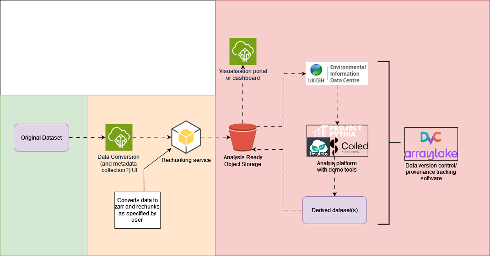

# DRI Gridded Data

DRI Gridded Data Repository. Work in progress. The idea with this repo is to develop a suite of tools to make working with large gridded datasets easier. This is outlined in the [diagram](https://github.com/NERC-CEH/dri_gridded_data/blob/main/img/gridded_data_tools_workflow_diagram.png) below. The background colours represent the progress of the work. Green = Done, Yellow = Actively being worked on, Red = Not started. 

The first product that we are developing is to allow for easy conversion of various gridded datasets to [ARCO](https://ieeexplore.ieee.org/abstract/document/9354557) ([Zarr](https://zarr.readthedocs.io/en/stable/)) format and easy upload to [object storage](https://github.com/NERC-CEH/object_store_tutorial?tab=readme-ov-file#what-is-object-storage). This product is built upon [pangeo-forge-recipes](https://pangeo-forge.readthedocs.io/en/latest/) which provides convenience functions for [Apache Beam](https://beam.apache.org/), which handles all the complexity of the performant parallelisation needed for rapid execution of the conversion. For more information on the reasons and motivation for converting data to ARCO format see the [README](https://github.com/NERC-CEH/object_store_tutorial) of the repository that generated the idea for this product. 

# Developer information

[Product description document](https://cehacuk.sharepoint.com/:w:/s/FDRI-WP2Digital/EbX7pJCS6alKrckL_jU-Dd8B41KHJYWzEYN27qGHkWXL7w?e=8gnEbc)

## Local installation

- Download local copy of repository: `git clone git@github.com:NERC-CEH/dri_gridded_data.git`
- Create a conda environment from the environment.yml file: `conda create --name dri_gridded_data --file environment.yml`

## Running instructions

- To run the netcdf --> zarr conversion script on your local machine: `ipython scripts/convert_GEAR_beam.py`
- To run it on a SLURM-controlled HPC (such as JASMIN LOTUS): `sbatch scripts/convert_GEAR_beam.sbatch`

(editing the variables defined in the scripts as appropriate)

# Disclaimer

THIS REPOSITORY IS PROVIDED THE AUTHORS AND CONTRIBUTORS “AS IS” AND ANY EXPRESS OR IMPLIED WARRANTIES, INCLUDING, BUT NOT LIMITED TO, THE IMPLIED WARRANTIES OF MERCHANTABILITY AND FITNESS FOR A PARTICULAR PURPOSE ARE DISCLAIMED. IN NO EVENT SHALL THE AUTHORS OR CONTRIBUTORS BE LIABLE FOR ANY DIRECT, INDIRECT, INCIDENTAL, SPECIAL, EXEMPLARY, OR CONSEQUENTIAL DAMAGES (INCLUDING, BUT NOT LIMITED TO, PROCUREMENT OF SUBSTITUTE GOODS OR SERVICES; LOSS OF USE, DATA, OR PROFITS; OR BUSINESS INTERRUPTION) HOWEVER CAUSED AND ON ANY THEORY OF LIABILITY, WHETHER IN CONTRACT, STRICT LIABILITY, OR TORT (INCLUDING NEGLIGENCE OR OTHERWISE) ARISING IN ANY WAY OUT OF THE USE OF THIS REPOSITORY, EVEN IF ADVISED OF THE POSSIBILITY OF SUCH DAMAGE.
